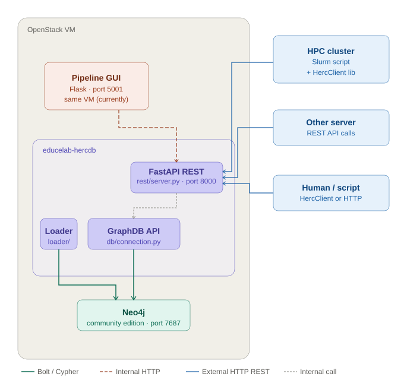
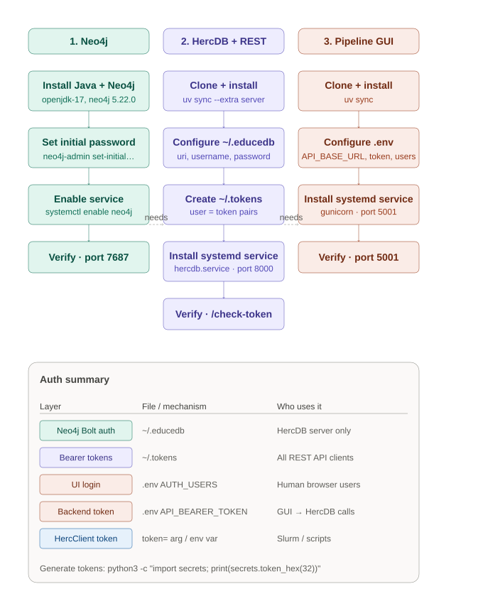

# EduceLab Herculaneum Graph Database API

This API is considered a work in progress and can change at any moment.

## Architecture



## Setup Quick Start

For a visual overview of the full setup process (beyond just this repo), see the quick start guide:



For step-by-step server setup instructions, see [docs/SERVER_SETUP.md](docs/SERVER_SETUP.md).

## Installation

This package supports two install modes:

### Client only (lightweight)

For remote machines that only need to call the REST API:

```shell
pip install educelab-hercdb
```

This installs only the `requests` library. See [src/educelab/hercdb/client/README.md](src/educelab/hercdb/client/README.md) for client usage.

### Server (full)

For running the REST API server, loading data, or querying Neo4j directly:

```shell
pip install educelab-hercdb[server]
```

This adds `fastapi`, `neo4j`, `numpy`, `pandas`, `prompt-toolkit`, and `uvicorn`.

## Development Setup

```shell
# Install base dependencies
uv sync

# Or with server extras (fastapi, neo4j, etc.)
uv sync --extra server

# Run commands in the environment
uv run python -c "from educelab.hercdb.client import HercClient"

# Or activate the venv directly
source .venv/bin/activate
```

## Client Library

```python
from educelab.hercdb.client import HercClient

client = HercClient(host="api.example.com", token="my-token")
pherc = client.get_pherc("211")
```

See [src/educelab/hercdb/client/README.md](src/educelab/hercdb/client/README.md) for the full API reference.

## Direct Database Connection

For environments with the `server` extra installed, you can connect to Neo4j directly:

```python
from educelab import hercdb

uri = "neo4j://localhost:7687"
user = "foo"
password = "bar"
db = hercdb.connect(uri, user, password)
if db.verify_connection():
  print("Connected!")
```

If credentials are not passed directly, the package reads them from `~/.educedb` or environment variables. See [docs/SERVER_SETUP.md](docs/SERVER_SETUP.md) for configuration details.

## REST API

A FastAPI-based REST API is available for querying the database over HTTP. All endpoints require Bearer token authentication.

```shell
uv run uvicorn educelab.hercdb.rest.server:app --reload
```

Interactive API docs are available at `/docs` (Swagger UI) and `/redoc` (ReDoc) once the server is running.

See [src/educelab/hercdb/rest/README.md](src/educelab/hercdb/rest/README.md) for endpoint documentation and [docs/SERVER_SETUP.md](docs/SERVER_SETUP.md) for production deployment.

## Loading Data

Data loading is done in two steps using the loader scripts. Both read CSV files from `input_data/`.

### 1. Load metadata and UUIDs

```shell
uv run python src/educelab/hercdb/loader/metadata_loader.py
```

Reads (defaults):
- `input_data/metadata_file.csv` - Pre-processed metadata file. (PHerc, Cornice, Pezzo, Disegni nodes and properties.)
- `input_data/uuid_file.csv` - Pre-processed uuid file. (all EduceLabID added)

Optional arguments:
```shell
uv run python src/educelab/hercdb/loader/metadata_loader.py \
  --metadata path/to/metadata.csv \
  --uuid path/to/uuid.csv
```

### 2. Load scan data

```shell
uv run python src/educelab/hercdb/loader/scan_loader.py
```

Reads (defaults):
- `input_data/negatives.csv` - FlatbedScanDataset nodes
- `input_data/photogrammetry-scans.csv` - PGSRaw nodes
- `input_data/spectral-scans.csv` - SpectralRaw nodes

Optional arguments:
```shell
uv run python src/educelab/hercdb/loader/scan_loader.py \
  --negatives path/to/negatives.csv \
  --photogrammetry path/to/pgs.csv \
  --spectral path/to/spectral.csv
```

**Note:** Run metadata_loader first since scan data links to EduceLabID nodes.

## Temporary Scripts and Notes

The `tmp/` directory contains temporary scripts, notes, and other informal resources shared among the team. Contents are version controlled but considered ephemeral — they may be rewritten or deleted at any time and should not be relied upon as stable code.

### Delete all data

To clear the database before reloading:

```python
from educelab.hercdb.loader import PhercGraphDatabaseLoader
loader = PhercGraphDatabaseLoader()
loader._delete_all_nodes()
```